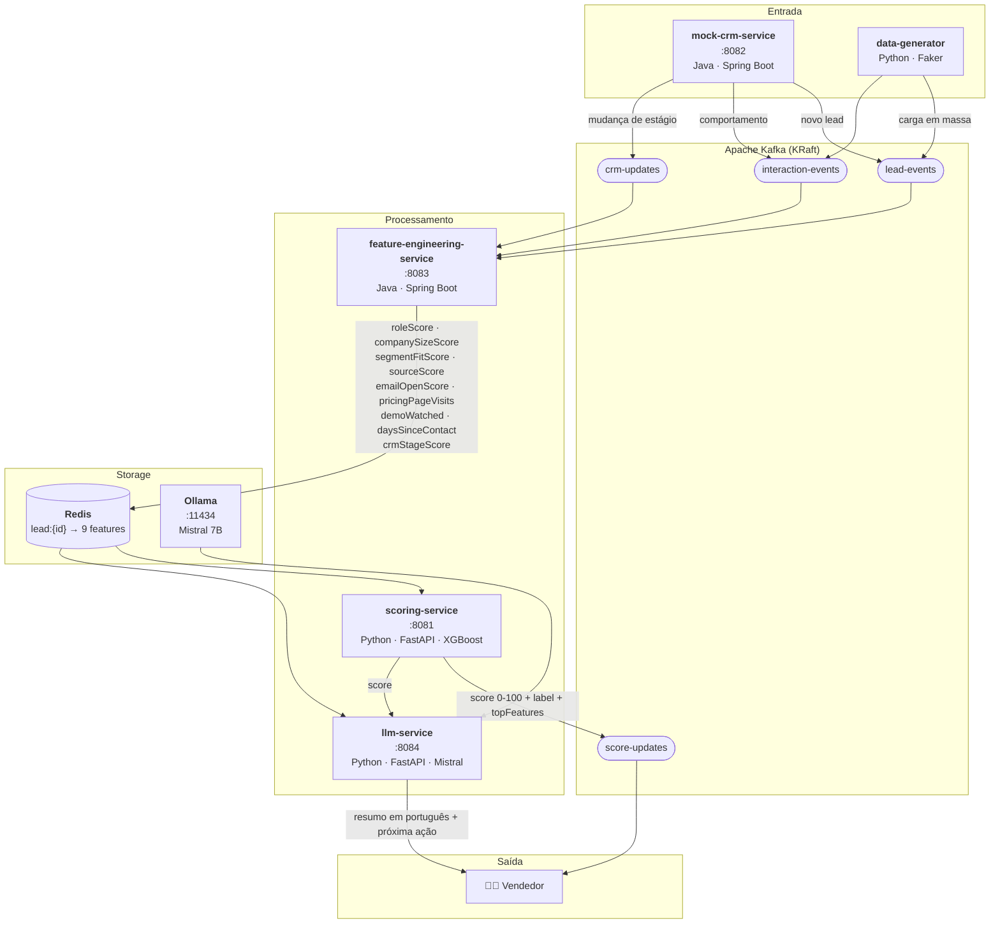

# Lead Scoring IA — B2B

Pipeline de IA para priorização inteligente de leads e aumento de receita. Cada lead recebe automaticamente um **score de 0 a 100** com base em dados comportamentais e de perfil, acompanhado de um resumo em português gerado por LLM local.

---

## Arquitetura



---

## Visão Geral

Times comerciais B2B recebem centenas de leads por mês de múltiplas fontes. Sem priorização, o vendedor trata todos igualmente — gastando 80% do tempo em leads que nunca vão fechar.

Este sistema resolve isso com um pipeline orientado a eventos que:

- Calcula o score de cada lead automaticamente ao receber qualquer novo evento
- Usa XGBoost treinado com dados de conversão reais (ou sintéticos no MVP)
- Gera um resumo em português via Mistral rodando **100% local**, sem custo de API
- Permite ao vendedor focar nos leads certos, no momento certo

**Custo de infraestrutura: R$ 0** — tudo roda em Docker local.

---

## Serviços

| Serviço | Tech | Porta | Responsabilidade |
|---|---|---|---|
| `mock-crm-service` | Java + Spring Boot | 8082 | Simula CRM — gera leads e eventos sintéticos |
| `feature-engineering-service` | Java + Spring Boot + Kafka | 8083 | Consome eventos, calcula e persiste 9 features no Redis |
| `scoring-service` | Python + FastAPI + XGBoost | 8081 | Calcula score 0-100 e publica no Kafka |
| `llm-service` | Python + FastAPI + Ollama | 8084 | Gera resumo em português via Mistral |
| `data-generator` | Python + Faker | — | Script para carga de dados sintéticos em massa |

---

## Tópicos Kafka

| Tópico | Produtor | Payload |
|---|---|---|
| `lead-events` | mock-crm-service / data-generator | Novo lead: nome, cargo, empresa, segmento, fonte |
| `interaction-events` | mock-crm-service / data-generator | Comportamento: e-mail aberto, visita a preços, demo |
| `crm-updates` | mock-crm-service | Mudança de estágio: NOVO → QUALIFICADO → PROPOSTA… |
| `score-updates` | scoring-service | Score calculado, label, top features, timestamp |

---

## Features do Modelo

| Feature | Base | Impacto |
|---|---|---|
| `roleScore` | Cargo (CEO=95, Diretor=90, Gerente=70, Analista=30) | Alto |
| `companySizeScore` | Nº funcionários (<50=20, 50-200=50, 200-1000=80, >1000=90) | Alto |
| `segmentFitScore` | Segmento da empresa (ICP configurável) | Alto |
| `sourceScore` | Origem (indicação=90, LinkedIn=70, evento=60, site=50) | Médio |
| `emailOpenScore` | E-mails abertos (proporcional, cap 100) | Médio |
| `pricingPageVisits` | Visitas à página de preços (sinal forte de intenção) | Alto |
| `demoWatched` | Assistiu demo (binário) | Muito Alto |
| `daysSinceLastContact` | Dias desde último contato (lead esfria após 14 dias) | Alto |
| `crmStageScore` | Estágio CRM (NOVO=10, QUALIFICADO=40, PROPOSTA=80, NEGOCIACAO=95) | Muito Alto |

---

## Labels de Score

| Score | Label | Ação sugerida |
|---|---|---|
| 80 – 100 | 🔥 QUENTE | Ligar hoje — alta prioridade |
| 50 – 79 | ⚡ MORNO | Enviar e-mail personalizado, agendar follow-up |
| 0 – 49 | ❄️ FRIO | Nurturing automático — não priorizar agora |

---

## Como Executar

### Pré-requisitos
- Docker + Docker Compose
- Java 17+
- Maven Wrapper (incluso nos serviços)

### 1. Subir a infraestrutura

```bash
docker-compose up -d
```

### 2. Baixar o modelo Mistral (uma vez, ~4 GB)

```bash
docker exec -it leadscoringia-ollama-1 ollama pull mistral
```

### 3. Rodar o feature-engineering-service

```bash
cd feature-engineering-service
./mvnw spring-boot:run
```

### 4. Rodar o mock-crm-service

```bash
cd mock-crm-service
./mvnw spring-boot:run
```

> Os serviços `scoring-service` e `llm-service` já sobem automaticamente via Docker Compose.

---

## API Endpoints

### scoring-service (`localhost:8081`)

```
GET  /score/{leadId}   → score individual de um lead
GET  /scores           → score de todos os leads (ordenado por score desc)
GET  /health
```

### llm-service (`localhost:8084`)

```
GET  /summary/{leadId}      → resumo em português para um lead
GET  /summary/batch/all     → resumos de todos os leads com score >= 50
GET  /health
```

### feature-engineering-service (`localhost:8083`)

```
GET  /api/features/{leadId}   → features brutas de um lead no Redis
GET  /api/features            → todas as chaves de leads no Redis
```

### mock-crm-service (`localhost:8082`)

```
GET   /api/leads                      → listar todos os leads
GET   /api/leads/{leadId}             → detalhe de um lead
POST  /api/leads                      → criar lead manualmente
POST  /api/leads/{leadId}/interaction → gerar interação manual
POST  /api/simulate/leads/{count}     → criar N leads de uma vez
```

---

## Exemplo de Resposta — LLM Summary

```json
{
  "leadId": "L-007",
  "name": "João Silva",
  "score": 92,
  "scoreLabel": "QUENTE",
  "nextAction": "Ligar hoje — alta prioridade",
  "topFeatures": ["crmStageScore", "emailOpenScore", "roleScore"],
  "summary": "João é Diretor de TI em empresa de manufatura com 500 funcionários — perfil ideal (ICP). Visitou a página de preços 3 vezes esta semana e assistiu à demo completa, sinalizando forte intenção de compra. Prioridade ALTA: ligar hoje."
}
```

---

## Stack Tecnológica

| Tecnologia | Uso |
|---|---|
| Java 17 + Spring Boot 4 | feature-engineering-service, mock-crm-service |
| Python 3.11 + FastAPI | scoring-service, llm-service, data-generator |
| Apache Kafka (KRaft) | Barramento de eventos — todos os tópicos |
| Redis 7 | Feature store em tempo real — estado atual por lead |
| XGBoost + scikit-learn | Modelo de classificação — score de conversão |
| Ollama + Mistral 7B | LLM local — resumo legível pelo vendedor |
| Faker (Python) | Geração de dados sintéticos para testes |
| Docker + Docker Compose | Orquestração completa do ambiente local |

---

## Roadmap

- [ ] `crm-sync-service` — publica score + resumo de volta para o CRM real (HubSpot/Pipedrive)
- [ ] `model-training-pipeline` — retreino semanal com dados reais de conversão
- [ ] DuckDB — persistência histórica de scores e features para análise
- [ ] Dashboard — visualização de scores e funil de conversão
- [ ] Produção — DuckDB → Snowflake · Ollama → API Mistral · mock-crm → HubSpot
